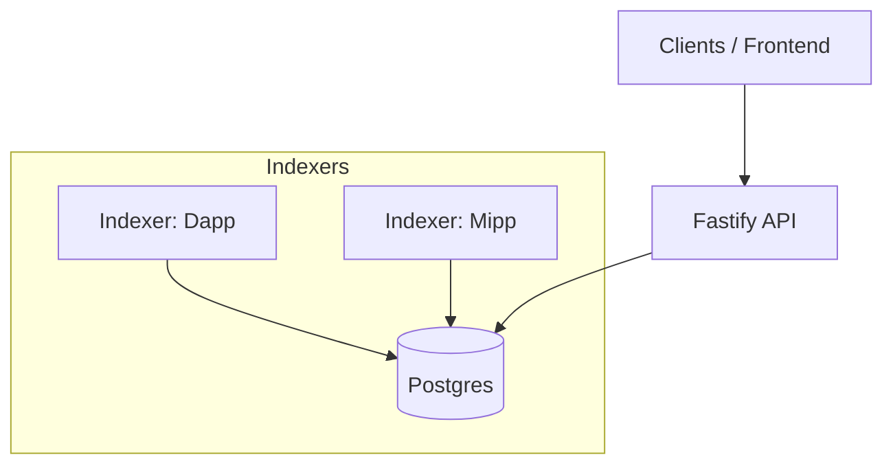

# 📡 Medialano Indexers & API

This repo contains the **indexers** (for Medialano Dapp + Mipp) and the **API service** that exposes the indexed data from Starknet into a PostgreSQL database.

It is designed for deployment on **Render** and can run in two modes:

* **Background Worker** (recommended for production)
* **Web Service workaround** (for free-tier testing)

---

## 🔑 Environment Variables

Each indexer has its own **`.env` file** (example: `.env.dapp`, `.env.mipp`).
They share the same PostgreSQL connection string but differ in **Apibara token, stream URL, starting block, and contract address**.

### Example: `.env.dapp`

```env
# --- MEDIALANO DAPP ENV ---

# Apibara token (specific to indexer)
DNA_TOKEN=

# Starknet Stream URL
STREAM_URL=https://sepolia.starknet.a5a.ch

# Starting block number (0 = genesis)
STARTING_BLOCK=1721833

# Contract address for this indexer
CONTRACT_ADDRESS=0x077840ce59ce16b3ceb3625059568e103eaae36635b82793b7386bed09fbc3a8

# Shared Postgres DB
POSTGRES_CONNECTION_STRING=
```

### Example: `.env.mipp`

```env
# --- MEDIALANO MIPP ENV ---

DNA_TOKEN=your_mipp_indexer_token
STREAM_URL=https://sepolia.starknet.a5a.ch
STARTING_BLOCK=1200000
CONTRACT_ADDRESS=0x1234567890abcdef...
POSTGRES_CONNECTION_STRING=
```

### Example: `.env`

```env
# --- FASTIFY API ENV ---
POSTGRES_CONNECTION_STRING=
```

### Notes

* `POSTGRES_CONNECTION_STRING` **must remain the same** across all indexers.
* Each indexer needs its own **Apibara DNA token** and **contract address**.
* Add new `.env.*` files for additional indexers.
* IF you want to run api service locally you need `.env` file to connect to postgrss DB


---

## 🚀 Running Locally

1. Install dependencies:

   ```bash
   pnpm install
   ```

2. Run a specific indexer (Dapp example):

   ```bash
   pnpm run start:indexer:dapp
   ```

3. Run API service:

   ```bash
   pnpm run start:api
   ```

4. Run both indexers together:

   ```bash
   pnpm run dev
   ```

---

## ☁️ Deployment

This repo is designed for **Render**.
You can deploy indexers either as **paid background workers** (recommended for production) or using a **free-tier web service workaround** (good for testing, not production).

---

### Option 1: Background Workers (**Recommended for Production**)

If you have a **paid Render instance**, deploy indexers directly as background workers.
This is the most reliable approach for production since the worker runs independently of any HTTP service.

```bash
pnpm run start:indexer:dapp
pnpm run start:indexer:mipp
```

* ✅ Stable and persistent
* ✅ Designed for long-running background tasks
* ❌ Not available on Render free tier

---

### Option 2: Web Service Workaround (**For Free Tier / Testing**)

Since Render does not provide **free background workers**, you can deploy indexers as **web services** instead.

The **entrypoint for this mode is `src/deployment-service.ts`**.
This wraps the indexer in a Fastify server that keeps the process alive, adds monitoring, and exposes health endpoints.

```bash
pnpm run start:indexer:dapp:web
pnpm run start:indexer:mipp:web
```

Endpoints provided:

* `/` → service summary

* `/status` → detailed runtime stats

* `/health` → LB-friendly health check

* `/restart` → manually restart indexer

* `/logs` → stub for future logs

* ✅ Works on Render free tier

* ✅ Adds health monitoring + auto-restarts

* ❌ Less reliable for production (depends on web process lifecycle)

---

### API Service (Always a Web Service)

The Fastify API should be deployed as a **web service** on Render:

```bash
pnpm run start:api:deploy
```

---

## 🗄️ Database

All indexers share the same **PostgreSQL database**.
Migrations are managed automatically when Apibara writes to the database.

You can connect using tools like **pgAdmin** or **psql**:

```sql
SELECT * FROM "cursor_table" LIMIT 20;
```

---

## 📊 Architecture



* **Indexer (Dapp/Mipp)** → Streams Starknet events → writes to **Postgres**
* **API** → Reads from **Postgres** → serves data to clients


---

## ✅ Summary

* Each indexer has its own `.env` file.
* **Use Background Workers for production** (paid Render).
* **Use Web Service mode for testing** (free Render, entrypoint is `src/deployment-service.ts`).
* Shared PostgreSQL database across all indexers.
* API always runs as a **web service**.

## ✅ Side notes useful command on dev
rm -rf ./drizzle         
npx drizzle-kit generate
npx drizzle-kit push
